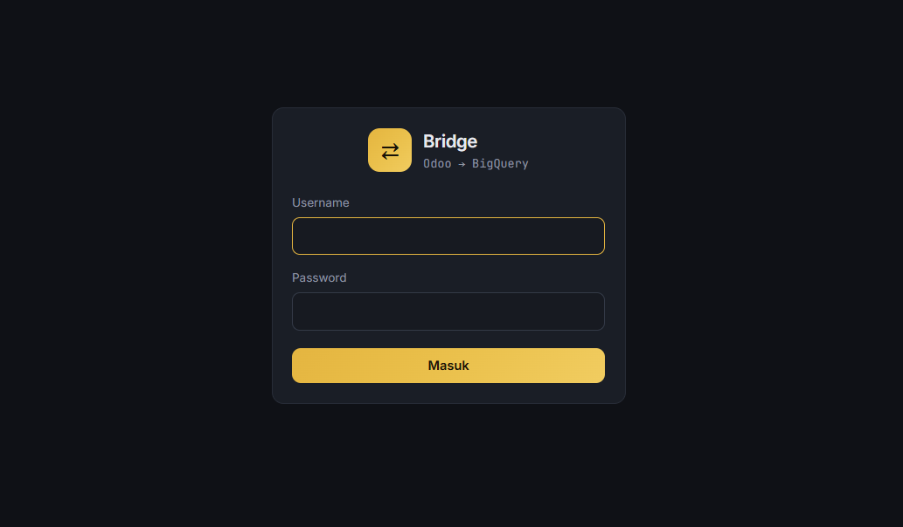
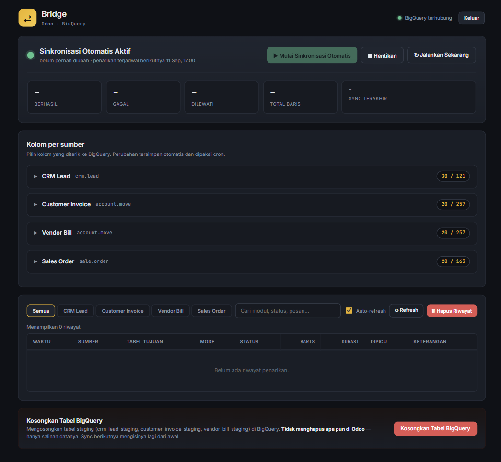
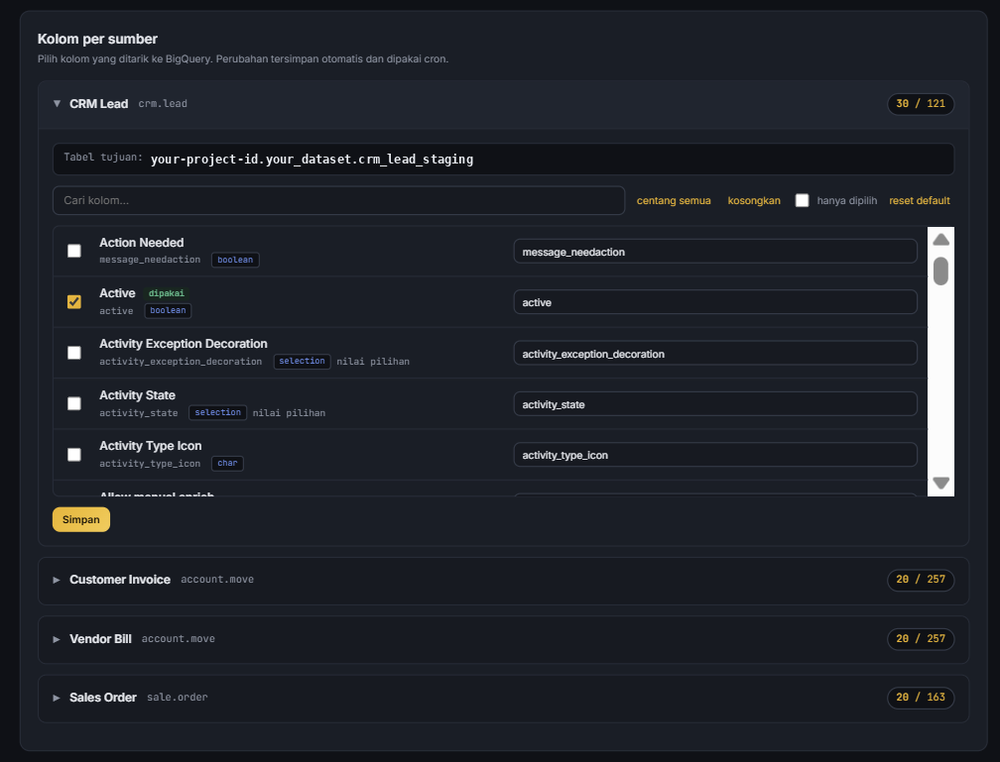

# Bridge — Odoo → BigQuery Data Pipeline

Bridge is a lightweight data integration system to transfer selected operational data from Odoo to Google BigQuery and provide a simple interface for configuring and monitoring the synchronization process.

The system separates the scheduled data pipeline from its management interface, allowing data extraction to continue independently from the web dashboard.

## Overview

Bridge connects Odoo operational data with BigQuery, where the datasets can be consumed by downstream business intelligence and analytics workflows.

The system currently supports:

- **CRM Lead**
- **Customer Invoice**
- **Vendor Bill**
- **Sales Order**

Data is loaded into BigQuery staging tables using a full-refresh approach.

## Key Features

### Automated Data Pipeline

- Retrieves selected fields from Odoo using a read-only data access flow
- Loads the extracted data into Google BigQuery
- Supports scheduled execution through system cron
- Can also be triggered manually

### Pipeline Management Dashboard

The web dashboard provides a central interface to:

- Configure which fields should be extracted from each Odoo module
- Start or stop automatic synchronization
- Trigger a synchronization manually
- View the next scheduled extraction
- Monitor synchronization status
- Review execution history
- Manage staging tables in BigQuery

### Monitoring & Logging

Each pipeline execution records information such as:

- Source module
- Destination table
- Execution mode
- Status
- Number of processed rows
- Execution duration
- Trigger type
- Error or execution notes

## Architecture

Bridge is designed around two independent processes:

```text
                    ┌──────────────────┐
                    │      Odoo        │
                    │ Operational Data │
                    └────────┬─────────┘
                             │
                             ▼
                  ┌─────────────────────┐
                  │   Data Pipeline     │
                  │   run_pipeline.py   │
                  └─────────┬───────────┘
                            │
                            ▼
                  ┌─────────────────────┐
                  │   Google BigQuery   │
                  │   Staging Tables    │
                  └─────────┬───────────┘
                            │
                            ▼
                  ┌─────────────────────┐
                  │ Existing BI /       │
                  │ Analytics Workflows │
                  └─────────────────────┘


        ┌──────────────────────────────────┐
        │        Management Dashboard      │
        │ Configuration • Monitoring • Log │
        └──────────────────────────────────┘
```

The scheduled pipeline and web dashboard are intentionally separated. The pipeline does not depend on the web application being available, making scheduled extraction more reliable.

## Project Structure

| File / Folder | Purpose |
|---|---|
| `run_pipeline.py` | Entry point for scheduled data extraction |
| `app.py` / `wsgi.py` | Web dashboard application |
| `bridge.py` | Odoo and BigQuery connections and data transfer logic |
| `config_store.py` | Module definitions, environment configuration, and field catalog |
| `bq_log.py` | Pipeline execution history and synchronization control |
| `katalog_fields_odoo.json` | Field catalog the dashboard reads to build its column picker (demo data in this repo) |
| `install_cron.sh` | Helper for installing the scheduled cron job |
| `tambah_modul.py` | Helper for adding new Odoo modules |
| `simulate_cron.py` | Local scheduling test utility |
| `app.env.contoh` | Example environment configuration |

## BigQuery Tables

| Table | Purpose | Write Mode |
|---|---|---|
| `crm_lead_staging` | CRM Lead data | `WRITE_TRUNCATE` |
| `customer_invoice_staging` | Customer Invoice data | `WRITE_TRUNCATE` |
| `vendor_bill_staging` | Vendor Bill data | `WRITE_TRUNCATE` |
| `sale_order_staging` | Sales Order data | `WRITE_TRUNCATE` |
| `pipeline_control` | Automatic synchronization control | `WRITE_TRUNCATE` |
| `pipeline_run_log` | Pipeline execution history | `WRITE_APPEND` |

Staging tables are created automatically during the first synchronization.

## Configuration

Configuration is provided through environment variables. The example configuration is available in:

```text
app.env.contoh
```

The actual environment file should be kept outside version control because it contains credentials and other secrets.

Typical configuration includes:

```env
ODOO_URL=https://example.odoo.com
ODOO_DB=database_name
ODOO_USERNAME=read_only_user
ODOO_API_KEY=your_api_key

BQ_PROJECT=your-project-id
BQ_DATASET=your_dataset
BQ_LOCATION=asia-southeast2
```

Google Cloud authentication can be provided through the standard Google application credentials mechanism.

> **Security:** Never commit real API keys, passwords, service-account credentials, or production environment files to the repository.

## Running Locally

Create a virtual environment and install the required dependencies:

```bash
python -m venv venv

# Windows
.\venv\Scripts\Activate.ps1

# Linux / macOS
source venv/bin/activate

python -m pip install -r requirements.txt
```

Copy the example environment file and configure the required variables:

```bash
copy app.env.contoh app.env
```

Run a pipeline extraction:

```bash
python run_pipeline.py
```

> Running the pipeline end to end requires reachable Odoo and BigQuery targets.
> Without them, the dashboard still starts and the column picker is fully
> browsable from the demo catalog; pipeline actions will report a connection error.

Run the dashboard:

```bash
python app.py
```

The complete local testing procedure is documented in:

```text
PANDUAN_TES_LOKAL.md
```

## Adding a New Odoo Module

New Odoo modules can be added through the module configuration and field catalog.

A helper script is also provided:

```bash
python tambah_modul.py
```

See:

```text
PANDUAN_TAMBAH_MODUL.md
```

for the complete procedure.

## Screenshots

The screenshots demonstrate the application's authentication, configuration, monitoring, and execution history interfaces.

### Program Overview

<p align="center">
  <strong>Login Page</strong><br><br>
  
</p>

<br>

<p align="center">
  <strong>Dashboard</strong><br><br>
  
  
</p>

## Design Decisions

### Separating the Pipeline from the Dashboard

The scheduled extraction process runs independently from the web interface. This means a temporary dashboard outage does not prevent the scheduled pipeline from running.

### Configurable Field Selection

Instead of extracting every available field from each Odoo module, the system allows users to select the fields required by downstream analytics workflows.

The dashboard reads its column list from a cached field catalog (`katalog_fields_odoo.json`) rather than calling Odoo on every page load, so the picker renders without a live ERP connection. The catalog can be refreshed from Odoo on demand via `tambah_modul.py`.

### Centralized Configuration

Operational configuration and credentials are kept outside the user interface and supplied through environment variables.

### Read-Only Access to Odoo

The pipeline retrieves data without modifying the source ERP system.

## Security

- Credentials are provided through environment variables and are not stored in the repository.
- Odoo access is read-only.
- The cron endpoint is protected by a token.
- Dashboard access is protected by authentication.
- Operational controls are exposed only through the authenticated dashboard.
- The BigQuery table-clearing function affects staging data only and does not modify data in Odoo.

## Project Context

**Type:** Data Integration & Analytics System  
**Role:** Business Analyst & System Developer  
**Status:** Completed
